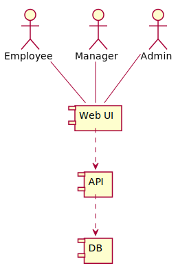
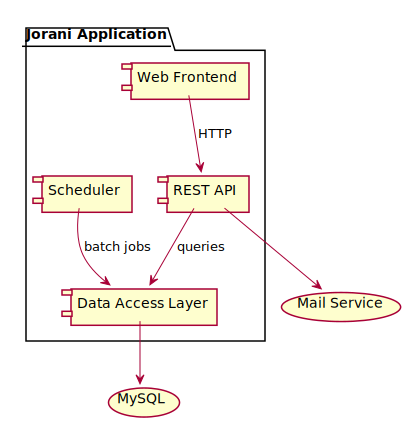
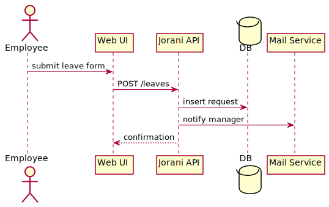

# Architecture

This folder contains draft diagrams describing the high level structure of Jorani.

## System Context

## Component Diagram

## Data Flow

## Database Schema Changes

The database separates user credentials from employee profiles by using distinct `users` and `employees` tables. Leave requests
reference both tables via foreign keys and link to `leave_types` for classification. This layout allows modules such as reporting or
notifications to evolve independently without schema conflicts.

## Service Boundaries

Jorani exposes a REST API that isolates the web UI from core business logic. The API and the scheduler access the database through a
shared data access layer, while notification duties are delegated to an external mail service. These boundaries permit independent
deployment and scaling of the web front-end, API, and background services.
